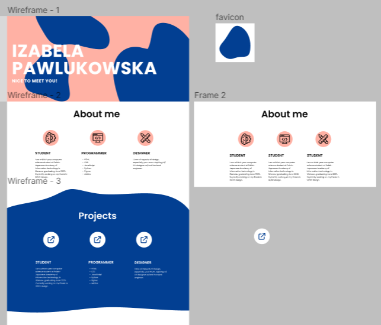

# vizaav.github.io

# Personal Website

This is the repository for my personal website, hosted on GitHub Pages at [vizaav.github.io](https://vizaav.github.io/).


## Technologies Used

- Vite
- Tailwind CSS
- TypeScript

## Project Structure

- `src/`: Contains the TypeScript and CSS source files.
- `public/`: Contains static files like images.
- `index.html`: The main HTML file.
- `package.json`: Defines the project dependencies and scripts.
- `postcss.config.js` and `tailwind.config.js`: Configuration files for PostCSS and Tailwind CSS.

## Development

To run the project locally, use the following command:

```bash
npm run dev

```

This will start a local development server.

## Building

To build the project for production, use the following command:

```bash
npm run build
```

This will create a dist/ directory with the built files.


